# crossfade

* Go module for crossfading between two image files.
* Started out as a fork of [phrozen/blend](https://github.com/phrozen/blend).
* Includes a `blend` command line utility, for mixing two images 50%/50%.

[github.com/anthonysimon/bild](https://github.com/anthonynsimon/bild) is a more popular choice than this package.

## Example use of the Go package

    crossfade.Files("a.png", "b.png", "out.png", 0.5)

The last argument is a float that regulates the transition from one image to the other, where 0.0 is only `"a.png"`, while 1.0 is only `"b.png"`.

## Screenshots

0% lemur 100% mountain

20% lemur 80% mountain

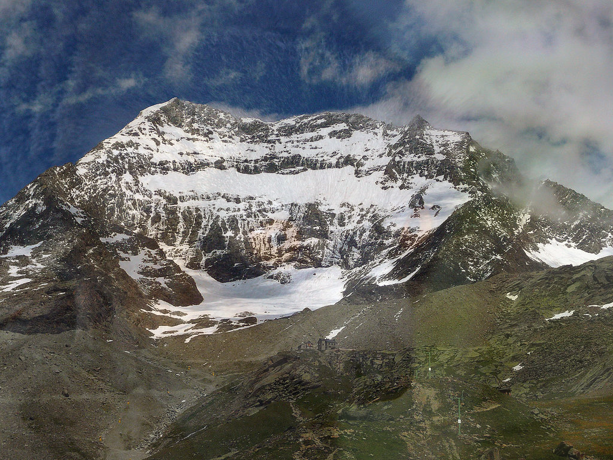

50% lemur 50% mountain

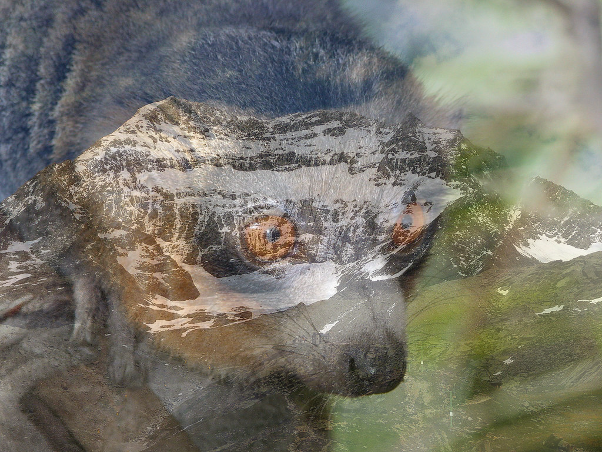

80% lemur 20% mountain

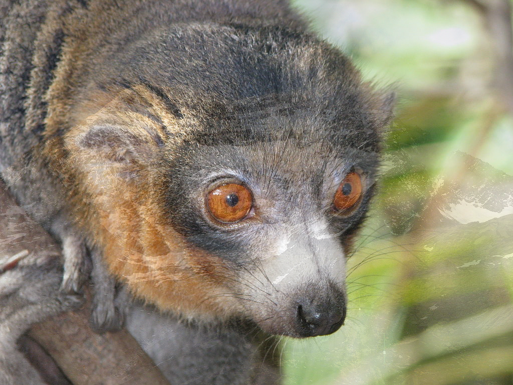

100% lemur 0% mountain

The images are from wikipedia: <a href="https://en.wikipedia.org/wiki/File:Eulemur_mongoz_(male_-_face).jpg">lemur</a> | [mountain](https://nn.wikipedia.org/wiki/Fil:Lagginhorn_west_face.jpg)

## Blendmode examples

| A                                    | B                                              |
|--------------------------------------|------------------------------------------------|
| 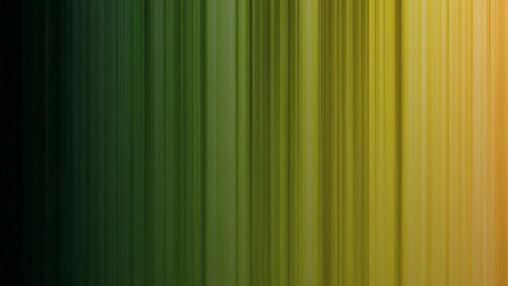 | 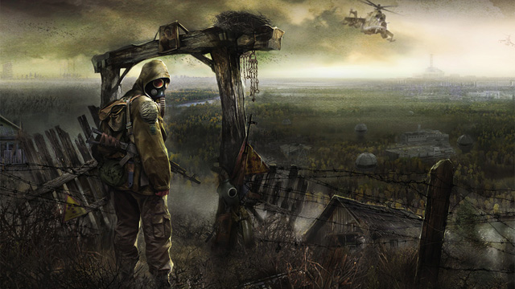 |

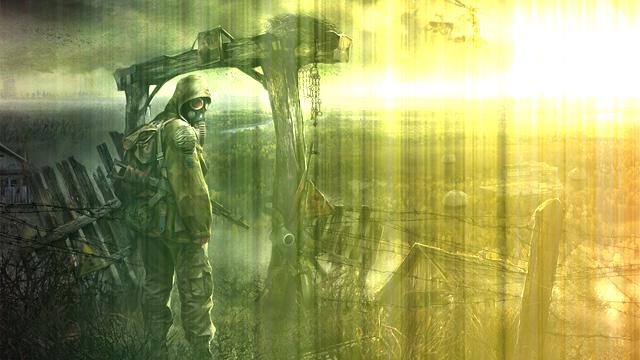

Add

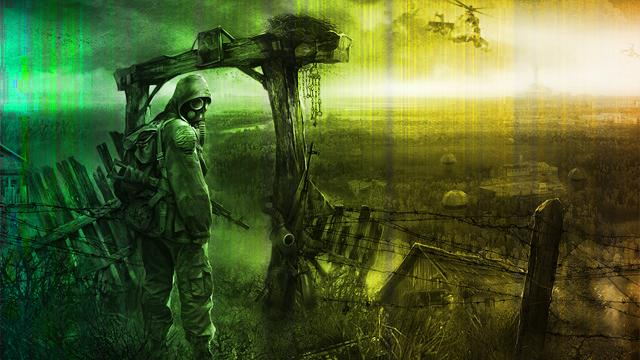

Color

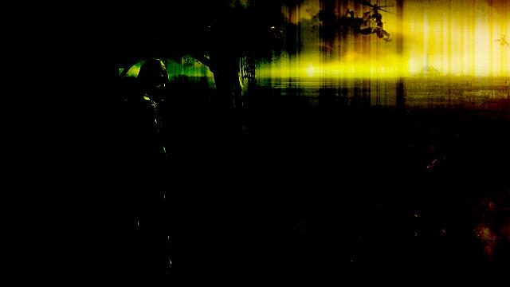

Color Burn

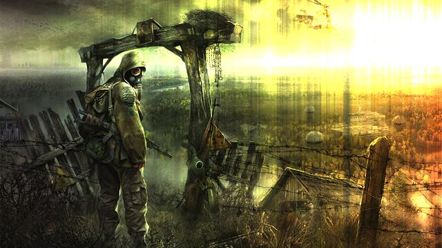

Color Dodge

Darken

Darker Color

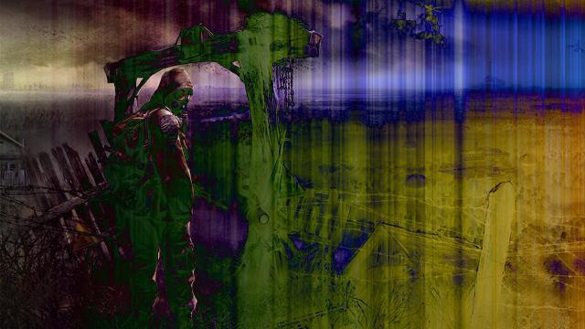

Difference

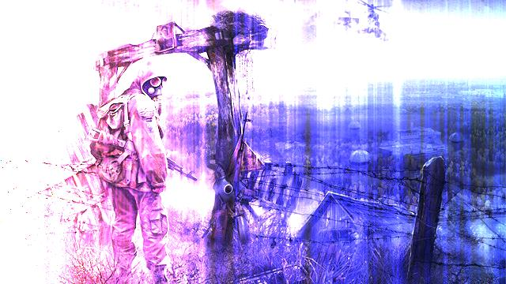

Divide

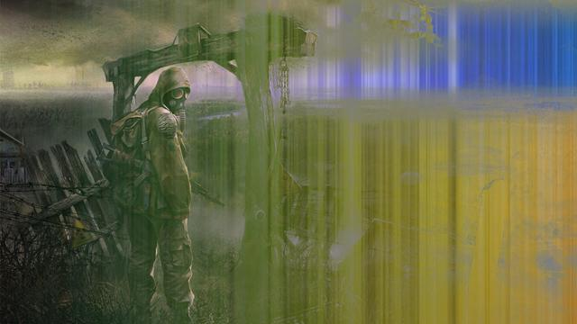

Exclusion

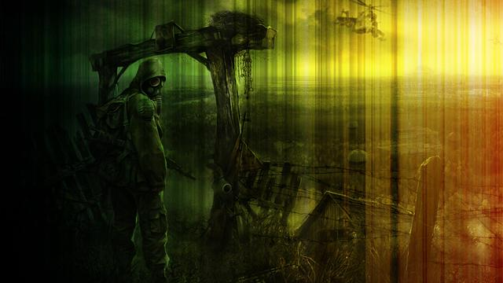

Hard Light

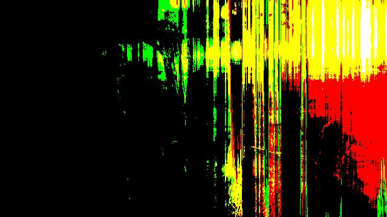

Hard Mix

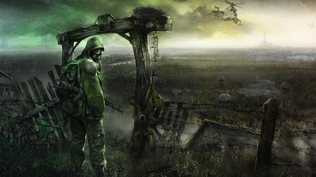

Hue

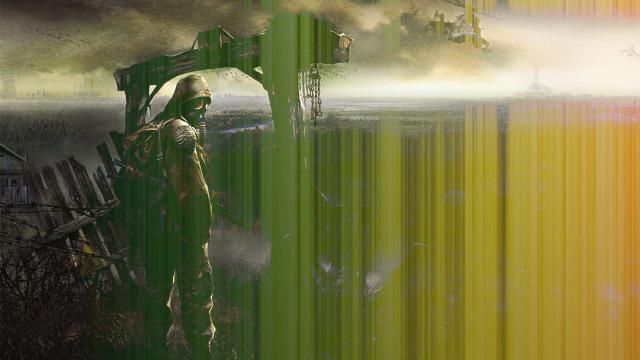

Lighten

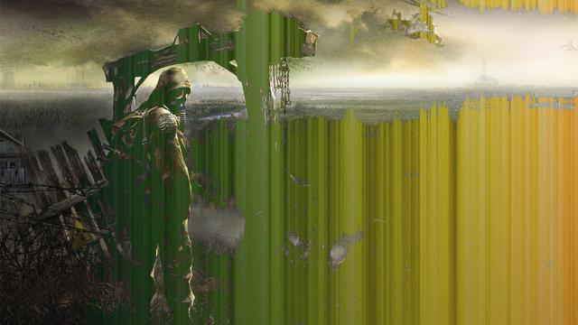

Lighter Color

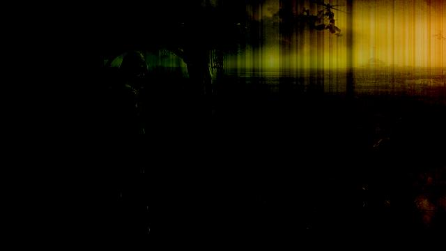

Linear Burn

Linear Dodge

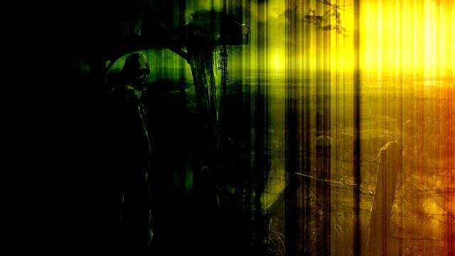

Linear Light

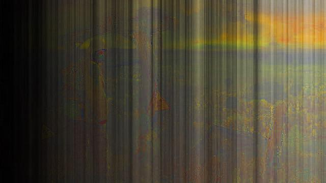

Luminosity

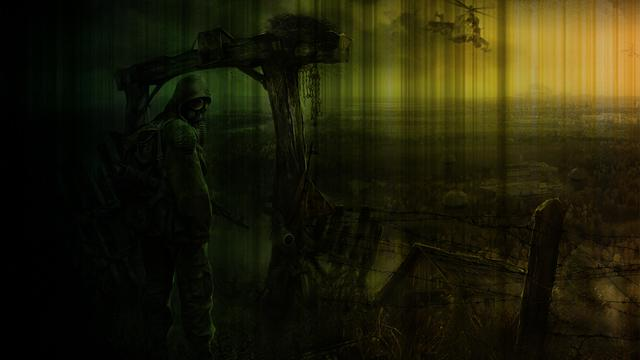

Multiply

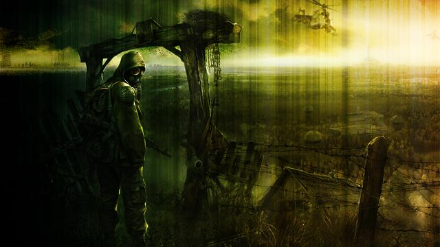

Overlay

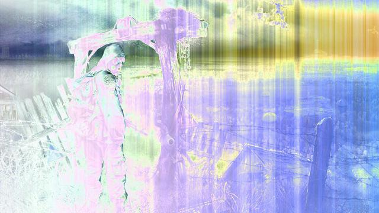

Phoenix

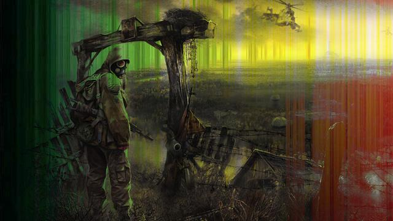

Pin Light

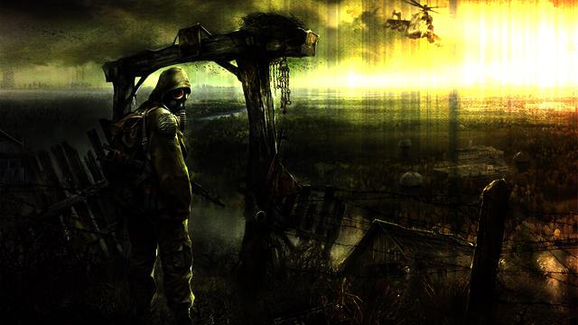

Reflex

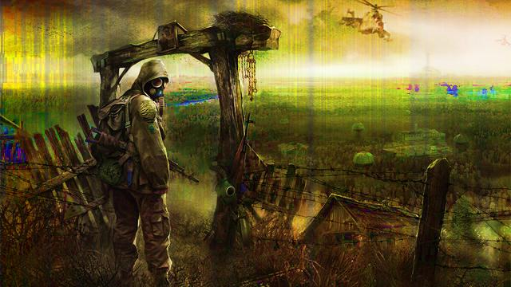

Saturation

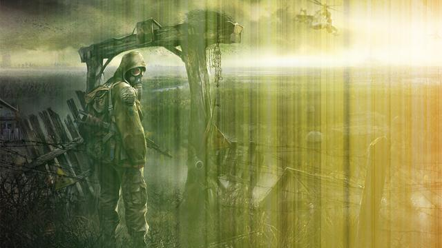

Screen

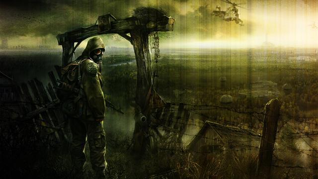

Soft Light

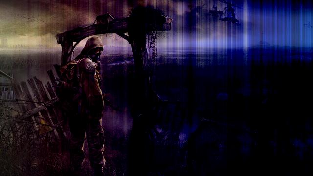

Substract

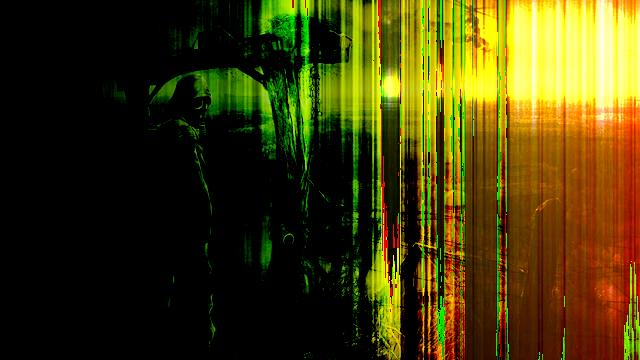

Vivid Light

Note that these images and blend modes are from the [phrozen/blend](github.com/phrozen/blend) repo that this repo was forked from.

## General info

* License: MIT
* Version: 1.1.2
