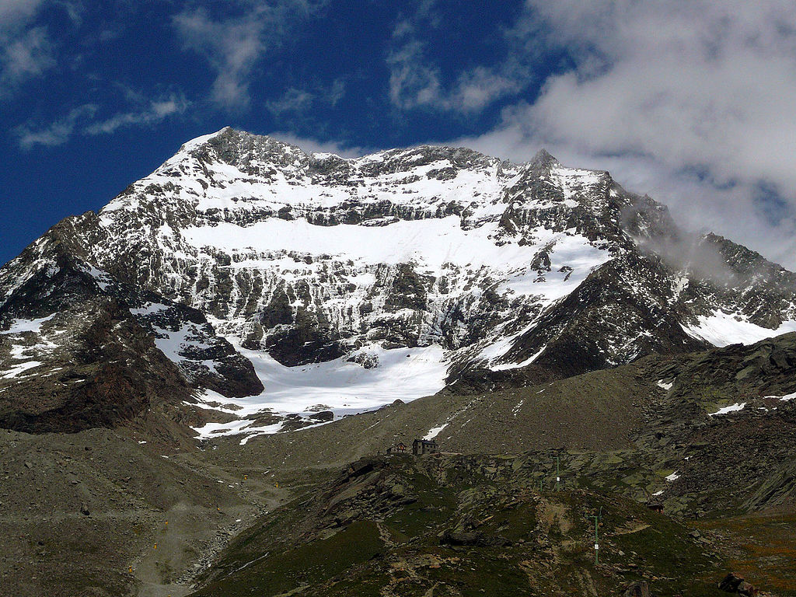
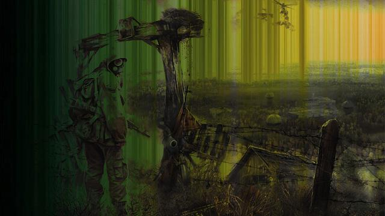

# crossfade

* Go module for crossfading between two image files.
* Started out as a fork of [phrozen/blend](https://github.com/phrozen/blend).
* Includes a `blend` command line utility, for mixing two images 50%/50%.

[github.com/anthonysimon/bild](https://github.com/anthonynsimon/bild) is a more popular choice than this package.

## Example use of the Go package

    crossfade.Files("a.png", "b.png", "out.png", 0.5)

The last argument is a float that regulates the transition from one image to the other, where 0.0 is only `"a.png"`, while 1.0 is only `"b.png"`.

## Screenshots

0% lemur 100% mountain

20% lemur 80% mountain

50% lemur 50% mountain

80% lemur 20% mountain

100% lemur 0% mountain

The images are from wikipedia: <a href="https://en.wikipedia.org/wiki/File:Eulemur_mongoz_(male_-_face).jpg">lemur</a> | [mountain](https://nn.wikipedia.org/wiki/Fil:Lagginhorn_west_face.jpg)

## Blendmode examples

| A                                    | B                                              |
|--------------------------------------|------------------------------------------------|
|  |  |

add

color

color_burn

color_dodge

darken

darker_color

difference

divide

exclusion

hard_light

hard_mix

hue

lighten

lighter_color

linear_burn

linear_dodge

linear_light

luminosity

multiply

overlay

phoenix

pin_light

reflex

saturation

screen

soft_light

substract

vivid_light

## General info

* License: BSD-3
* Version: 1.1.1
